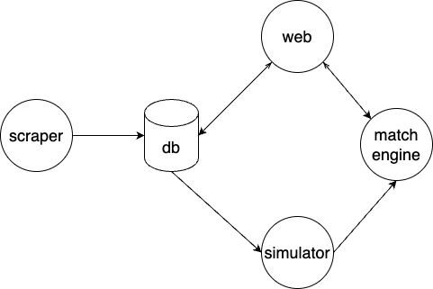

# trading_simulator

This is a demo project to demonstrate my software development skills.

The project is a trading simulator platform that allows users to simulate trading stocks in real-time. The platform retrieves real-time market data for the top 10 highest-valued companies from the Nasdaq website. Users can then simulate buying and selling stocks to see how their investments perform over time. 

The system structure diagram is shown below:

## scraper
 
 A web crawler that retrieves real-time market data for the top 10 highest-valued companies from the Nasdaq website. The crawler first downloads a CSV file containing information on all Nasdaq stocks. It then identifies the top 10 highest-valued companies from this data. Finally, the crawler visits each company’s detailed web page to extract real-time market data. The crawler continuously revisits these pages to update the stock’s real-time market data.

skills:
 * python
 * selenium
 
 ## web

 * display the real-time market data for the top 10 highest-valued Nasdaq companies. 
 * (under development)interface for users to simulate buying and selling stocks.
 * (under development)display the user’s order status and history.
 * (under development)display the simulation market data.

 You can visit the web page on http://89.34.18.234:9001/nasdaq/

skills:
* python
* django
* react
* restful api

## match engine (under development, the code is in my another github repository named [continuous_auction_demo](https://github.com/devswing1030/continuos_auction_demo))

* match the order with price priority and time priority.
* feed the order status back to the web server.
* feed the market data back to the web server.

skills:
* c++
* multithreading
* http server

## simulator (under development)

The simulator automatically inputs orders into the match engine, with each order constructed based on the real-time market data of the top 10 highest-valued Nasdaq companies. The order is created using the best available bid and ask prices.
